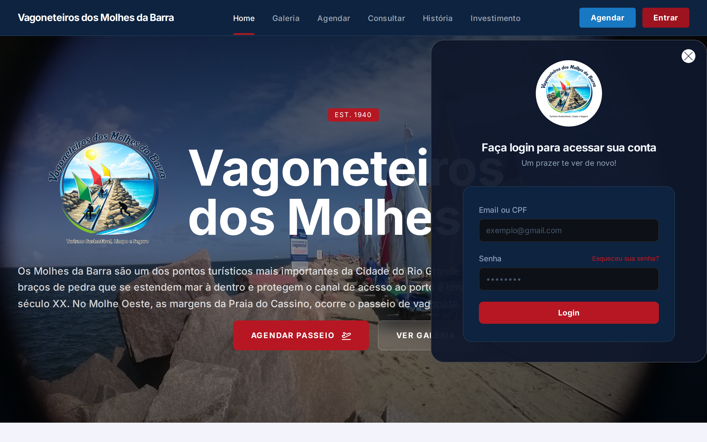
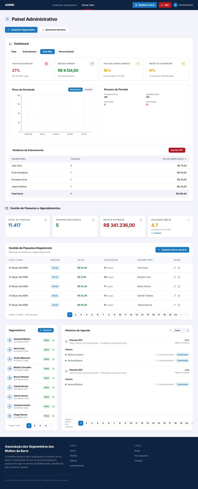

# 🚂 Vagoneteiros dos Molhes da Barra — Manual do Usuário

> **Versão:** 1.2
> **Última atualização:** 06/08/2026
> **Baseado na branch:** `release/v1.1`

---

## Índice

1. [Introdução](#1-introdução)
2. [Para Turistas e Usuários](#2-para-turistas-e-usuários)
3. [Para Vagoneteiros](#3-para-vagoneteiros)
4. [Para Administradores](#4-para-administradores)
5. [Dashboard e Relatórios](#5-dashboard-e-relatórios)
6. [Notificações Push](#6-notificações-push)
7. [Perguntas Frequentes](#7-perguntas-frequentes)

---

## 1. Introdução

### 1.1 O que é o sistema?

O **Vagoneteiros dos Molhes da Barra** é um sistema web para gerenciamento de passeios turísticos. Ele permite que:

- **Turistas** agendem passeios online
- **Vagoneteiros** gerenciem seus passeios e se auto-atribuam a vagas disponíveis
- **Administradores** controlem todo o fluxo: slots, clientes, agendamentos, vagoneteiros e dashboard

### 1.2 Acessando o sistema

O sistema é acessado via navegador web (Chrome, Firefox, Edge, etc.) no endereço fornecido pela associação.

### 1.3 Perfis de Acesso

| Perfil | O que pode fazer |
| --------------- | ------------------------------------------------------- |
| **USUARIO** | Agendar passeio, consultar agendamento |
| **VAGONETEIRO** | Auto-atribuição, feed de vagas, perfil de condutor |
| **ADMIN** | Controle total do sistema |
| **REDATOR** | Gerenciar passeios, clientes, agendamentos e avaliações |

---

## 2. Para Turistas e Usuários

### 2.1 Página Inicial

Ao acessar o sistema, você vê a **Home** com:

- Logotipo e nome da Associação
- História dos Vagoneteiros
- Linha do tempo interativa (1881 → hoje)
- Como funciona o passeio (trajeto, ponto de partida, horários)
- Galeria de fotos
- Avaliações de outros turistas — **nota do Google Maps exibida ao lado do título**
- Localização com mapa Google Maps
- Botão **"AGENDAR PASSEIO"** para iniciar um agendamento

> **Novidade v1.1:** A nota de avaliação do Google é carregada diretamente do banco de dados e exibida ao lado do título "AVALIAÇÕES" no formato `4.6 ⭐ (1)`. A nota é atualizada manualmente pelo administrador no painel.

### 2.2 Agendando um Passeio

1. Clique em **"Agendar"** no menu superior ou no botão **"AGENDAR PASSEIO"** na Home
2. Na página de agendamento:
   - O sistema exibe os **slots disponíveis** (dias e horários com vagas abertas)
   - **Selecione a data** no calendário interativo
   - **Escolha o horário** disponível
   - **Informe seus dados:** nome, CPF, telefone e email
   - **Consentimentos:** marque as opções necessárias
   - **Acompanhantes:** informe quantas pessoas irão acompanhar
3. Revise as informações e confirme o agendamento

> 💡 Os slots são criados pelos administradores. Se um horário não aparece, é porque todas as vagas já foram preenchidas ou não há slot cadastrado.

### 2.3 Consultando um Agendamento

1. Acesse a página **"Consulta Agendamento"** no menu
2. Informe seu **CPF** ou o **número do agendamento (ID)**
3. O sistema exibirá os detalhes do seu passeio agendado

### 2.4 Galeria de Fotos

1. Clique em **"Galeria"** no menu
2. Navegue pelas fotos dos passeios (atualmente 90 fotos carregadas via Google Drive)
3. Clique em uma foto para visualizar em tela cheia (lightbox)
4. Use as setas ou swipe para navegar entre as fotos
5. Clique no **X** ou fora da foto para fechar

> **Novidade v1.1:** Galeria com fotos reais armazenadas no Google Drive, integrada via API Google Drive.

### 2.5 Localização

Na Home, a seção **"LOCALIZAÇÃO"** mostra:

- Endereço completo
- Horários de funcionamento
- Mapa interativo do Google Maps
- Botão **"Ver Localização"** para abrir no Google Maps

---

## 3. Para Vagoneteiros

### 3.1 Como me cadastro como vagoneteiro?

1. **Pelo Administrador** no painel administrativo (cadastro manual)
2. **Conversão de perfil** — o administrador altera seu perfil para **VAGONETEIRO** na edição de usuários

### 3.2 Como funciona a Auto-Atribuição? (Modelo Uber)

1. Faça login no sistema com seu CPF/email e senha
2. Acesse **"Feed de Vagas"** no menu
3. Você verá um feed com todos os slots disponíveis (não atribuídos)
4. Cada card mostra: data, horário, duração, valor e número de vagas
5. Clique em **"Pegar Passeio"** para se auto-atribuir ao slot

**Regras:**
- ✅ Você só vê slots **não atribuídos** a outro vagoneteiro
- ✅ O sistema verifica **conflitos de horário**
- ✅ Verifica **capacidade** do slot
- ✅ Verifica se você já não está atribuído àquele slot

### 3.3 Minhas Atribuições

Acesse **"Minhas Atribuições"** para ver todos os passeios que você pegou:

- **Status das atribuições:**
  - **ATRIBUIDO** ✅ — Você pegou o passeio
  - **REALIZADO** 🟢 — Passeio concluído
  - **CANCELADO** 🔴 — Passeio cancelado

**Ações disponíveis:**
- **Cancelar atribuição** — se não puder mais realizar
- **Marcar como realizado** — após concluir

### 3.4 Meu Perfil de Vagoneteiro

Suas informações ficam disponíveis no sistema:

- **Nome** e **CPF**
- **Telefone** e **email**
- **Histórico** (sobre você)
- **Experiência** (tempo de atuação)
- **Status** (ativo/inativo)
- **Foto** (opcional)
- **Slots atribuídos** a você

### 3.5 Ativo vs Inativo

- **Ativo** ✅ — Você aparece no feed de vagas e pode se auto-atribuir
- **Inativo** ❌ — Você não aparece e não pode pegar novos passeios

---

## 4. Para Administradores

### 4.1 Acessando o Painel Administrativo

1. Faça login clicando em **"Entrar"** no menu superior
2. Use seu **CPF ou email** e **senha**
3. Após login, acesse o **Painel Admin** pelo menu
4. O painel exibe os dados reais da API

### 4.2 Login

- Login via **popup modal**
- CPF (com ou sem formatação) ou email
- Senha verificada com bcrypt
- Após login, seu nome e perfil ficam visíveis no header

### 4.3 Gestão de Slots

> O antigo "Cadastrar Passeio" foi substituído pelo **Gerenciar Slots**.

Cada slot tem: data/horário, duração, capacidade (default 5), título, status e vagoneteiro.

**Tipos de Slot:**

| Tipo | Descrição | Quando usar |
| ----------------- | -------------------------------------------- | ----------------------------------------------- |
| **FIXO** 🗓️ | Recorrência semanal | Passeios que acontecem sempre no mesmo dia |
| **LOTE** 📦 | Range de datas com intervalo | Criar vários slots de uma vez |
| **INDIVIDUAL** 🎯 | Slot único que não se repete | Passeio específico sem recorrência |

### 4.4 Gestão de Passeios (Legado)

> ⚠️ Substituído por **Gerenciar Slots**. Passeios existentes continuam funcionais para consulta.

### 4.5 Gestão de Clientes

- Cadastrar: nome, CPF, telefone (obrigatórios), email (opcional)
- Busca automática por CPF/CNPJ no agendamento público
- Apenas ADMIN e REDATOR podem cadastrar, editar e excluir

### 4.6 Gestão de Agendamentos

**Status do Agendamento:**

| Status | Significado |
| ----------- | ------------------------ |
| **PENDENTE** | Aguardando confirmação |
| **CONFIRMADO** | Confirmado |
| **CANCELADO** | Cancelado |
| **REMARCADO** | Remarcado |
| **REALIZADO** | Passeio concluído |

> **Novidade v1.1:** Adicionado status **REALIZADO** para agendamentos concluídos.

### 4.7 Gestão de Avaliações

**Funcionalidades:**
- Listar todas as avaliações
- Cadastrar, editar e excluir avaliação
- **Cache de avaliação do Google Maps** — nota armazenada no banco (seed inicial: 4.6)
- **Botão "Atualizar"** no painel admin para editar nota e total de avaliações
- Nota exibida na Home ao lado do título AVALIAÇÕES

> **Novidade v1.1:** Avaliação do Google é armazenada em cache no banco (tabela `AvaliacaoCache`). O administrador pode atualizar manualmente quando quiser através do botão no card do painel. A nota aparece automaticamente na página inicial.

### 4.8 Gestão de Usuários e Vagoneteiros

- Apenas **ADMIN** lista todos os usuários
- Listagem paginada (9 por página)
- **Ativar/Desativar** vagoneteiro (alterna ativo/inativo)
- Perfil completo com foto e slots vinculados
- Campo perfil no cadastro e edição

### 4.9 Seção de Investimento

Exibe informações sobre preços e valores dos passeios para turistas.

---

## 5. Dashboard e Relatórios

> **NOVO na v1.1!** O Dashboard traz uma visão analítica completa do negócio.

### 5.1 Acessando o Dashboard

1. Faça login como **ADMIN** ou **REDATOR**
2. No painel administrativo, clique em **"Dashboard"**
3. O dashboard carrega com os dados atuais do sistema

### 5.2 Componentes do Dashboard

#### Métricas Principais (Cards)

- **Total de passeios realizados** no período
- **Total de clientes** atendidos
- **Faturamento total** no período (formatado em R$)
- **Avaliação Média** com data da última atualização

> **Novidade v1.1:** Valores formatados em **pt-BR** (R$ 1.234,56). Cards carregam via proxy do Vite configurado para rota `/painel`.

#### Gráfico de Picos de Demanda

- Exibe os **horários de maior procura**
- Ajuda a identificar horários mais populares
- Útil para planejar novos slots em períodos de pico

#### Relatório de Faturamento

- Tabela detalhada com receitas por período
- Total de agendamentos realizados
- Faturamento bruto

#### Filtros

| Filtro | Descrição |
| ----------------- | ------------------------------------------------- |
| **Hoje** | Dados do dia atual |
| **Esta semana** | De segunda a domingo |
| **Este mês** | Mês atual (do dia 1 ao último dia) |
| **Personalizado** | Escolha data início e fim com calendário |

### 5.3 Exportação em PDF

> **Novidade v1.1:** Relatório geral exportável em PDF com dados frescos do backend.

1. Clique no botão **"Relatório Geral"** no cabeçalho do painel
2. Escolha o período desejado no modal:
   - **📅 Hoje** — apenas o dia atual
   - **📆 Esta Semana** — de segunda a domingo
   - **📊 Este Mês** — do dia 1 ao último dia do mês
   - **📈 Personalizado** — dois calendários para escolher data inicial e final
3. O sistema busca dados atualizados do backend e gera um PDF contendo:
   - **Estatísticas Gerais** — turistas, passeios realizados, receita, avaliação
   - **Passeios Cadastrados** — tabela com data, horário, valor, capacidade, vagoneteiro
   - **Vagoneteiros** — lista com nome, CPF, telefone, status
   - **Histórico de Agendamentos** — tabela com passeio, data, cliente, status
4. O PDF é baixado automaticamente com o período no nome do arquivo

> 💡 O relatório busca dados **diretamente do backend** no momento da geração, garantindo que as estatísticas estejam sempre atualizadas. O filtro de período é aplicado em todos os itens do relatório.

### 5.4 Atualização da Avaliação

No painel admin, o card de **Avaliação Média** exibe:

- Nota atual (ex: 4.6)
- Data da última atualização
- Botão **"Atualizar"** que abre um modal para editar:
  - **Nota média** (ex: 4.6)
  - **Total de avaliações** (ex: 1)
- Ao salvar, a nota é atualizada no banco e reflete na Home

---

## 6. Notificações Push

### 6.1 O que são?

Lembretes automáticos enviados para o navegador do cliente sobre agendamentos futuros. Funcionam mesmo com o site fechado.

### 6.2 Como funciona?

1. Ao fazer um agendamento, o cliente pode **autorizar notificações**
2. O navegador solicita permissão
3. Se aceito, o sistema agenda lembretes automáticos
4. O cron job do servidor dispara as notificações nos momentos certos

### 6.3 Intervalos de Lembrete

| Intervalo | Quando envia |
| ---------- | ---------------- |
| 1 semana | 7 dias antes |
| 3 dias | 3 dias antes |
| 1 dia | 1 dia antes |
| 12 horas | Meio dia antes |
| 6 horas | 6 horas antes |
| 3 horas | 3 horas antes |
| 1 hora | 1 hora antes |
| 30 minutos | 30 minutos antes |
| 10 minutos | 10 minutos antes |

> **Configurado com Firebase Cloud Messaging** usando projeto `vagoneteirosteste`. O service account está configurado no backend e as credenciais do frontend no `.env`.

---

## 7. Perguntas Frequentes

### 7.1 Esqueci minha senha. Como recuperar?

**Agora sim!** (v1.1) O sistema possui recuperação automática por e-mail:

1. Clique em **"Entrar"** e depois em **"Esqueceu sua senha?"** (link abaixo do campo de senha)
2. Digite seu **e-mail cadastrado**
3. Você receberá um e-mail do **vagoneteiros@gmail.com** com um link
4. O link expira em **1 hora** e é de uso único
5. Clique no link e crie uma nova senha (mínimo 6 caracteres)

> 🔐 Se você não receber o e-mail, verifique a caixa de spam. Se ainda assim não encontrar, confirme com o administrador se seu e-mail está correto na base.

### 7.2 Posso agendar sem fazer cadastro?

**Sim!** O agendamento público permite que turistas agendem sem login.

### 7.3 Como faço para me tornar vagoneteiro?

1. **Pelo Administrador** no painel
2. **Convertendo seu perfil** — o admin altera de USUARIO para VAGONETEIRO

### 7.3 Posso receber confirmação por e-mail?

**Sim!** (v1.1) Ao fazer um agendamento informando seu e-mail, o sistema envia automaticamente um **e-mail de confirmação** com:

- **Código do agendamento** (#número) — apresente no dia do passeio
- **Data e horário** do passeio
- **Nome do passeio** e valor
- Informação sobre lembretes (se autorizou notificações)

O e-mail tem o mesmo layout visual do sistema (fundo escuro, cores Vagoneteiros).

> 📩 **Não recebeu o e-mail?** Confira a **caixa de spam**. Se ainda assim não encontrar, confirme se digitou o e-mail corretamente no formulário de agendamento ou fale com o administrador.

### 7.4 Posso cancelar um agendamento?

Sim, o administrador pode alterar para **CANCELADO** ou **REMARCADO**.

### 7.5 O que significa "ativo" e "inativo" para vagoneteiros?

- **Ativo** → Disponível, aparece no feed e pode se auto-atribuir
- **Inativo** → Indisponível

### 7.6 Como funciona a auto-atribuição?

O vagoneteiro acessa o **"Feed de Vagas"**, vê todos os slots disponíveis e clica em **"Pegar Passeio"**.

### 7.7 O que mudou com o sistema de slots?

O antigo "Cadastrar Passeio" foi substituído pelo **Gerenciar Slots**. Agora você cria slots de 3 formas: FIXO, INDIVIDUAL e LOTE.

### 7.8 Quantas fotos tem na galeria?

Atualmente **90 fotos** carregadas via Google Drive, com navegação em lightbox.

### 7.9 O sistema funciona no celular?

Sim! O sistema é **responsivo** e funciona em smartphones, tablets e desktops.

### 7.10 O que é o Dashboard?

É a nova seção de análise do sistema (v1.1), com métricas de passeios, gráfico de picos de demanda, relatório de faturamento, filtros por período e exportação em PDF com período selecionável.

### 7.11 Como atualizar a avaliação do Google?

No painel admin, o card **Avaliação Média** tem um botão "Atualizar". Clique, digite a nova nota e o total de avaliações, e salve. A mudança reflete na Home automaticamente.

### 7.13 O relatório em PDF mostra dados corretos?

Sim! O relatório busca dados **frescos** do backend no momento da geração, e o filtro de período é aplicado em todas as seções (estatísticas, passeios, agendamentos). Não depende do estado da página.

---

> ⚡ **Vagoneteiros dos Molhes da Barra** — Desde 1932 levando turistas pelo maior molhe do mundo.
